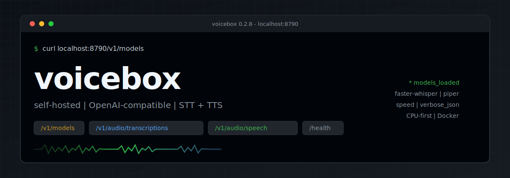
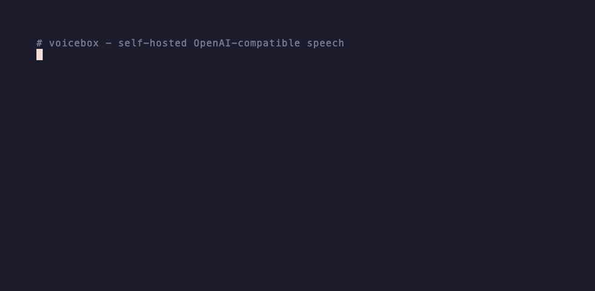

<p align="center">
  
</p>

# voicebox

Self-hosted, OpenAI-compatible speech server. Speech-to-text (`faster-whisper`)
and text-to-speech (`Piper` or `Kokoro`) behind the same HTTP API as OpenAI's
audio endpoints, so Open WebUI, agents, CLIs, and coding assistants get a local
voice with no glue code.

<p align="center">
  <a href="LICENSE"></a>
  <a href="https://github.com/agjs/voicebox/actions/workflows/test.yml"></a>
  
  <a href="https://github.com/agjs/voicebox/pkgs/container/voicebox"></a>
  
</p>

<p align="center">
  
</p>

## Why this

- **Fully local.** No cloud calls and no required API keys; audio stays on your machine.
- **OpenAI drop-in.** `GET /v1/models`, `POST /v1/audio/transcriptions` (including `verbose_json` segment timestamps), and `POST /v1/audio/speech` with `voice` and `speed` (0.25-4.0).
- **CPU-fast by default.** Piper TTS runs roughly 14x faster than real-time on a plain quad-core; STT uses distil-whisper int8. Thread caps stay aligned with your container CPU quota.
- **One Docker command.** Models bake into the image; `docker compose up` is enough.
- **Works with your stack.** Open WebUI, included voice-chat / Claude Code clients, or any OpenAI-audio SDK.

## Quick start

You only need Docker. The models are baked into the image. Compose binds to
localhost by default; set a private bind address when clients are on another machine.

```bash
git clone https://github.com/agjs/voicebox.git && cd voicebox
cp .env.example .env
docker compose up -d --build      # first build downloads the models (a few minutes)

curl -fsS localhost:8790/health   # {"status":"ok","models_loaded":true}
```

Text to speech:

```bash
curl -fsS localhost:8790/v1/audio/speech \
  -H "Content-Type: application/json" \
  -d '{"model":"tts","input":"Hello from voicebox.","response_format":"wav"}' \
  --output hello.wav
```

Speech to text:

```bash
curl -fsS localhost:8790/v1/audio/transcriptions \
  -F "file=@hello.wav" -F "model=stt"
# {"text":"Hello from voicebox."}
```

Point any OpenAI-audio-compatible client at `http://<host>:8790/v1` and you are done.

For LAN access, set `VOICEBOX_BIND_ADDRESS` to a private IP on the host (or
`0.0.0.0` when a firewall controls access). Set `VOICEBOX_API_KEY` as well; clients
can send it as an OpenAI-style bearer token. The health endpoint intentionally
remains unauthenticated for container probes.

> No Docker? `pip install -e ".[dev]" && python -m voicebox` also works. It needs
> `ffmpeg` and `espeak-ng` on the host.

## Use it with your apps

### Open WebUI

In Admin, open Settings then Audio:

| Setting | Value |
|---|---|
| Speech-to-Text Engine | `OpenAI` |
| STT API Base URL | `http://<host>:8790/v1` |
| STT API Key | `sk-none`, or your `VOICEBOX_API_KEY` when authentication is enabled |
| Text-to-Speech Engine | `OpenAI` |
| TTS API Base URL | `http://<host>:8790/v1` |
| TTS Voice | Piper: a baked id such as `en_US-amy-medium` (default engine). Kokoro: e.g. `af_heart`. |

### Included clients (`clients/`)

`clients/voice-chat/` is a turn-taking CLI with 30 ms VAD, streamed LLM output,
background Piper synthesis, and gapless queued playback. `clients/claude-code/`
has a Stop hook that synthesizes the first sentence before the remainder, plus a
push-to-talk dictation helper. Both read
`VOICEBOX_URL` (voice-chat also takes your LLM endpoint).

## Voices

TTS defaults to Piper, which is fast, natural, and CPU-friendly. Three voices
ship baked into the image. Switch with `VOICEBOX_PIPER_VOICE` or the request
`voice` field (must be one of the baked ids; unknown voices return 400):

| `VOICEBOX_PIPER_VOICE` / request `voice` | character |
|---|---|
| `en_US-amy-medium` (default) | warm, female |
| `en_US-bryce-medium` | male |
| `en_US-lessac-medium` | clear, neutral |

Audition every Piper voice at https://rhasspy.github.io/piper-samples/ . Found
one you like? Set `VOICEBOX_PIPER_VOICE=en_US-<voice>-<quality>`, add it to
`scripts/fetch_models.py`, and rebuild. Runtime Hugging Face access is deliberately
offline, so voices must be baked into the image.

Speaking rate: request `speed` on `/v1/audio/speech` (OpenAI-style 0.25-4.0,
default 1.0), or set `VOICEBOX_PIPER_LENGTH_SCALE` as the base rate (lower is
faster: `1.0` natural, `0.8` brisk, `1.2` slow narration). Effective Piper
length scale is `VOICEBOX_PIPER_LENGTH_SCALE / speed`.

### Two engines

`piper` (default) is the fastest, with great quality, roughly 7 times faster
than Kokoro on CPU. `kokoro` gives higher-fidelity neural voices (about 50 of
them, such as `af_bella` and `bf_emma`) but is slower on CPU. Switch to it with
`VOICEBOX_TTS_ENGINE=kokoro` and pick a voice with the `voice` request field or
`VOICEBOX_DEFAULT_VOICE`.

## API

| Endpoint | Description |
|---|---|
| `GET /v1/models` | Lists the STT model id and available TTS voice ids for the active engine. |
| `POST /v1/audio/transcriptions` | Multipart `file` (any common audio format), `language`, and `response_format=json\|text\|verbose_json`. `verbose_json` includes segment timestamps. |
| `POST /v1/audio/speech` | JSON `{input, voice?, speed?, response_format?}`. `speed` is 0.25-4.0 (default 1.0). Piper `voice` must be one of the baked voices (`en_US-amy-medium`, `en_US-bryce-medium`, `en_US-lessac-medium`). `wav` is complete; `pcm` is streamed 16-bit mono and declares its format in `X-Audio-*` headers. |
| `GET /health` | Returns `{"status":"ok","models_loaded":true}`. |

The shapes match OpenAI's audio API, so existing SDKs and clients work unmodified.

## Configuration

Everything is set with environment variables (see `.env.example`):

| Variable | Default | Description |
|---|---|---|
| `VOICEBOX_TTS_ENGINE` | `piper` | `piper` or `kokoro` |
| `VOICEBOX_PIPER_VOICE` | `en_US-amy-medium` | Piper voice id |
| `VOICEBOX_PIPER_LENGTH_SCALE` | `1.0` | Speaking rate (lower is faster) |
| `VOICEBOX_PIPER_NOISE_SCALE` | `0.667` | Prosody variability |
| `VOICEBOX_PIPER_NOISE_W` | `0.8` | Phoneme-duration variability |
| `VOICEBOX_STT_MODEL` | `Systran/faster-distil-whisper-small.en` | faster-whisper model |
| `VOICEBOX_STT_MODEL_REVISION` | pinned commit | Reproducible Hugging Face model revision |
| `VOICEBOX_STT_BEAM_SIZE` | `1` | Greedy decoding for interactive latency; use `5` for more accuracy |
| `VOICEBOX_STT_VAD_FILTER` | `true` | Remove non-speech with faster-whisper's Silero VAD |
| `VOICEBOX_STT_MIN_SILENCE_MS` | `500` | Silence removed by server-side VAD |
| `VOICEBOX_STT_HOTWORDS` | empty | Comma-separated project names and vocabulary hints |
| `VOICEBOX_TTS_MODEL` | `speaches-ai/Kokoro-82M-v1.0-ONNX` | Kokoro model (when engine is kokoro) |
| `VOICEBOX_DEFAULT_VOICE` | `af_heart` | Kokoro default voice |
| `VOICEBOX_DEVICE` | `cpu` | `cpu` or `cuda` |
| `VOICEBOX_CPU_THREADS` | `4` | CTranslate2 CPU threads for STT. Match physical cores / `VOICEBOX_CPUS`. Compose also sets `OMP_NUM_THREADS` and `MKL_NUM_THREADS` from this value to avoid OpenMP oversubscription (more threads than CPUs often hurts latency). Bare-metal runs should export the same OpenMP/MKL vars before starting the process. |
| `VOICEBOX_API_KEY` | empty | Optional bearer token protecting audio endpoints |
| `VOICEBOX_BIND_ADDRESS` | `127.0.0.1` | Host interface published by Docker Compose |
| `VOICEBOX_PORT` | `8790` | Listen port |
| `VOICEBOX_MAX_AUDIO_SECONDS` | `120` | Reject longer STT input |
| `VOICEBOX_MAX_UPLOAD_MB` | `25` | Reject larger uploads |
| `VOICEBOX_MAX_INPUT_CHARS` | `4000` | Reject longer TTS text |

## Performance

CPU-only, on one reference box (a 2015-era quad-core, no GPU):

| Stage | Model | Real-time factor |
|---|---|---|
| STT | `distil-whisper-small.en` (int8) | about 0.3x (roughly 3x faster than real-time) |
| TTS | Piper `amy-medium` | about 0.07x (roughly 14x faster than real-time) |
| TTS | Kokoro-82M | about 0.5x |

For that class of CPU, keep Piper, int8 STT, four inference threads, and a
four-CPU container quota. Cap OpenMP/MKL to that same thread count (Compose wires
`OMP_NUM_THREADS` / `MKL_NUM_THREADS` from `VOICEBOX_CPU_THREADS`); oversubscribing
threads past the cgroup CPU limit usually adds latency rather than removing it.
If latency varies under load, give voicebox priority over heavier background
services and watch for sustained frequency drops. A future CUDA node can use
`VOICEBOX_DEVICE=cuda`; the CPU-oriented Piper path remains the default. The
supplied image is CPU-only: a future GPU deployment also needs a CUDA/cuDNN
runtime image (or a host installation with those libraries), not only the
environment-variable change.

## Development

```bash
pip install -e ".[dev]"
pytest -m "not model and not latency"  # fast unit suite, including clients
pytest                    # full local model + latency suite
docker compose up -d --build && ./scripts/smoke.sh   # end-to-end
```

Under `src/voicebox/`: `stt.py` (faster-whisper), `tts.py` (Kokoro),
`tts_piper.py` (Piper), `app.py` (FastAPI routes), `config.py` (env), `wav.py`.

## Licenses

voicebox itself is MIT (see [`LICENSE`](LICENSE)). It builds on:

| Component | License |
|---|---|
| faster-whisper, ONNX Runtime, kokoro-onnx | MIT |
| Kokoro-82M model | Apache-2.0 |
| Piper voices (amy, bryce, lessac) | public domain / MIT |
| `piper-tts` | GPL-3.0 |

Note on `piper-tts`: it is GPL-3.0. voicebox's own source is MIT and only imports
it (nothing is vendored), but the prebuilt Docker image bundles it, so a
distributed image carries GPL obligations for that component. If you need a
purely permissive image, set `VOICEBOX_TTS_ENGINE=kokoro` and drop `piper-tts`
from `pyproject.toml` and the Dockerfile.
